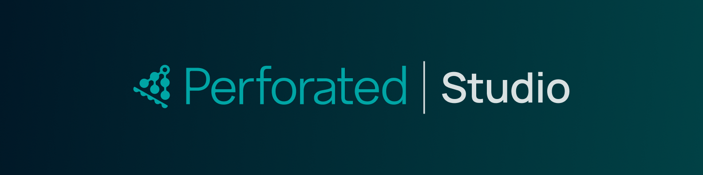

<div align="center">



### Better accuracy, smaller models, less data - enabled by perforated learning


</div>

# Introduction
Perforated is a data-efficiency layer for machine learning that adds artificial **dendrites** to your neural network. By adding neuron-specific learning signals during training, Perforated helps models achieve higher accuracy with fewer parameters, less data, and lower deployment costs. It integrates directly into existing PyTorch workflows with minimal code changes. 

Perforated Studio is the coding agent and dashboard that combines the CLI feel with a dashboard to make it simple and easy to get started perforating your models. 

<div align="center">
<video autoplay="" loop="" muted="" playsinline="" class="w-full h-auto" aria-label="Perforated Studio demo visualization" data-astro-cid-x2wsp3hm=""> <source src="assets/perforated-studio-hero-video-x4speed-12s.mp4" type="video/mp4" data-astro-cid-x2wsp3hm="">
Your browser does not support the video tag.
</video>
</div>

---

## Quickstart

### Before you start

- **Docker**, running. The shared Server ships as a container; the installer fails fast if Docker isn't up.
- **Python**, in the project's own environment, with `torch` installed. The export script and the
  PerforatedAI training loop run locally in that environment, not inside the Server container.
- **Claude Code**, in the project you want to add dendrites to.
- **A PyTorch project** with a model class and a dataloader you can import.

You do **not** need to install PerforatedAI or the Studio by hand. The skills walk you through it.

### 1. MCP Server Installation

Open a terminal and run

**Mac/Linux:**  
```sh
curl -fsSL https://raw.githubusercontent.com/PerforatedAI/studio-install/main/bootstrap.sh | sh
```

Add `-s -- --port 4000` if something already owns port 3002. (The `-s --` is how you pass flags
through a pipe — they go to `sh`, not to `curl`.)

**Native Windows (PowerShell):**

```powershell
iwr -useb https://raw.githubusercontent.com/PerforatedAI/studio-install/main/bootstrap.ps1 -OutFile bootstrap.ps1
.\bootstrap.ps1
```

Add `-Port 4000` if something already owns port 3002.

This starts the shared Server (a single long-lived container, independent of any coding agent session).
need to re-run this step.

### 2. Register this project (once per project)

In the Claude Code session in your project, ask Claude to register it:

```
/register-project-studio
```

The Skill walks you through the steps. Your project gets its own Project ID and only ever sees its own data.

**Then restart Claude Code.** It reads `.mcp.json` at startup, so a running session won't see the Studio until you do.

### 3. Check it's alive

```
/dashboard-studio
```

Claude pings the Server and opens the Studio in your browser. If it says the server isn't connected, see [Troubleshooting](#troubleshooting).

### 4. Look at your model

```
/visualize-model-studio
```

Claude asks for your model file, class name, and dataloader, runs the export script locally, and
opens the result as an interactive graph.

This step is optional, but it is a good way to visualize your model you are about to train.

### 5. Add dendrites

```
/perforate-my-model-studio
```

The Skill walks you through wrapping your model with PerforatedAI: which layers get dendrites, what
the switching policy is, and how the training loop changes. It writes a Perforation Config next to
your model.

This skill also brings up the Studio setup page which assists you in configuring your project, setting baselines, and keeps track of your goals.

### 6. Train, and watch it grow

```
/train-my-model-studio
```

Claude collects your save name and training script, wires the training run to the Studio, opens
the **Training View**, and hands you the command to run. Start training, and the page fills in live:

- **Dendrites** — the diagram on the left. Each time a dendrite set is *successfully integrated*, a
  new dendrite sprouts, tapping the same inputs as the neuron and feeding back into it. The count
  below it is exact even when the drawing caps out.
- **Score per epoch** — validation and train score, with each switch marked. Reload bursts (PerforatedAI
  re-trying a candidate dendrite set) branch the line instead of drawing backward over itself.
- **Learning Rate**, **Epoch Times**, **Param Counts**, **PB Scores** — the diagnostics, in the grid.

All the charts start visible. Ask Claude to hide the noisy ones (`hide the epoch times chart`) and
it will; the choice resets on the next run.

> **Watch the gap.** More switches than dendrites is normal and interesting: it means PerforatedAI
> tried a dendrite set and rejected it because it didn't earn its place. Three switches with two
> dendrites is the model telling you it's saturating.

### 7. Read the results

```
/perforatedai-analyze-studio
```

The Skill reads the run output and tells you what the dendrites bought you — accuracy per parameter
added, where returns started diminishing, what to try next.

---

## Install reference

**Requirements:** `docker`, running, on the host.

### macOS / Linux

```sh
curl -fsSL https://raw.githubusercontent.com/PerforatedAI/studio-install/main/bootstrap.sh | sh
```

Through a pipe, flags go to `sh`, not to `curl` — pass them after `-s --`:

```sh
curl -fsSL https://raw.githubusercontent.com/PerforatedAI/studio-install/main/bootstrap.sh | sh -s -- --port 4000
```

| Flag | Default | Description |
|---|---|---|
| `--version <v>` | `latest` | Install a specific version, e.g. `--version v0.1.1` |
| `--port <n>` | `3002` | Port the shared Server listens on (only affects the first machine install) |
| `--update` | — | Stop and replace the running Server with a fresh one on the current image |

### Windows (PowerShell)

No WSL or Git Bash needed.

```powershell
iwr -useb https://raw.githubusercontent.com/PerforatedAI/studio-install/main/bootstrap.ps1 -OutFile bootstrap.ps1
.\bootstrap.ps1
```

Flags are passed as named parameters, e.g. `.\bootstrap.ps1 -Port 4000`:

| Parameter | Default | Description |
|---|---|---|
| `-Version <v>` | `latest` | Install a specific version, e.g. `-Version v0.1.1` |
| `-Port <n>` | `3002` | Port the shared Server listens on (only affects the first machine install) |
| `-Update` | — | Stop and replace the running Server with a fresh one on the current image |

> **Windows support:** `bootstrap.ps1` mirrors the Unix flow but **has not been tested on a real Windows machine**. If you encounter issues, please report them.

---

## What it does to your machine

1. Pulls the Studio image from `ghcr.io/perforatedai/studio` and checks it that it installed correctly.
2. Starts a shared Docker container (`perforatedai-studio-server`).
3. Stores Server state in a named Docker volume (`perforatedai-studio-data`).
4. Records the installation in `~/.perforated_studio/` for tracking and upgrades.

**It does not touch any project directories.** Each project registers itself separately via the `/register-project-studio` Skill in Claude Code, which adds entries to that project's `.mcp.json` and `.perforated_tools/` — but leaves nothing on disk until the Skill is run.

---

## Updating

### Machine-wide

To update the Studio to a new version, run the installer again with `--update`:

```sh
curl -fsSL https://raw.githubusercontent.com/PerforatedAI/studio-install/main/bootstrap.sh | sh -s -- --update
```

*Running Without `--update`, re-running the installer ensures the machine-level Server is
running (starting it if it isn't) and records the new version but does not stop a running Server that's already up.*

Running update will do two things, install the latest Perforated Stuido docker container and update the corresponding Studio skills.

### Project-level (export scripts)  
Each project also has a small set of bundled scripts under `.perforated_tools/` (the model export
script and its helpers). Re-run `/register-project-studio` in a project to re-sync those against the
running Server. It keeps the project's existing structure in the servers state after a major update.
---

## Uninstalling

There are two levels of uninstall with different meanings.

### Remove a single project's registration

From the project directory:

```sh
.perforated_tools/uninstall.sh
```

On Windows: `.perforated_tools\uninstall.ps1`

This removes the project's `Perforated-Studio` entry from `.mcp.json`, the bundled export scripts, and
the registration files (`project.json`, `installed.json`), then removes `.perforated_tools/` itself if
nothing else is left in it. Skills are machine-global and are left in place. Anything you added to
`.perforated_tools/` yourself (exports, training runs) is left alone. **Does not touch the shared
Server** — other projects on this machine keep running untouched.

### Remove the shared Server (machine-level)

In any Claude Code session:

```
/uninstall-studio
```

The Skill walks you through the machine-wide teardown: it confirms scope first, then stops and
removes the Server container, removes the globally installed skills named in the machine manifest
(hand-written skills are left alone), and removes the machine manifest (`~/.perforated_studio/`). The
`perforatedai-studio-data` volume (Experiments and persisted runs) is **kept** unless you explicitly
ask it to purge that too. It also offers to deregister the current project so it doesn't keep a stale
`.mcp.json` entry; any *other* registered projects keep their stale entries until you run their own
`.perforated_tools/uninstall.sh`.

To run the teardown script directly instead:

```sh
~/.perforated_studio/bin/uninstall.sh          # add --purge-data to also drop the data volume
```

On Windows:

```powershell
& "$env:USERPROFILE\.perforated_studio\bin\uninstall-server.ps1"   # add -PurgeData to also drop the data volume
```

---

## Troubleshooting

**`/dashboard-studio` says the MCP Server isn't connected.**
Almost always a stale Claude Code session try to restart claude code. Also, check `/mcp` for more details. If that doesn't do it, check
`docker ps --filter name=perforatedai-studio-server` and `docker logs perforatedai-studio-server`
for the Server's own output.

**Port already in use.**
This can happen when the Studio is first installed. Some other application uses the default port `3002`. Re-run the machine install with `--port`:  
`curl -fsSL https://raw.githubusercontent.com/PerforatedAI/studio-install/main/bootstrap.sh | sh -s -- --port 4000`.
Every project after that reuses whatever port the running Server is already on.

**Stale `.mcp.json` after a machine uninstall.**
Expected. Removing the shared Server does not rewrite every project's `.mcp.json`. Re-run
`/register-project-studio` after reinstalling the Server, or remove the entry by hand.

**The Training View says "waiting for training run".**
The page is open and connected; it just hasn't received a `run_start` yet. That's expected until
your training script actually starts.

**The dendrite diagram never grows.**
Dendrites only appear on *successful integration*, which is not the same as a switch. If the Score
chart shows switches but the diagram stays at zero, PerforatedAI is trying dendrite sets and
rejecting all of them — that's a real result, not a bug. Check the PB Scores chart: flat or absent
candidate scores mean the dendrites aren't learning anything worth keeping.

